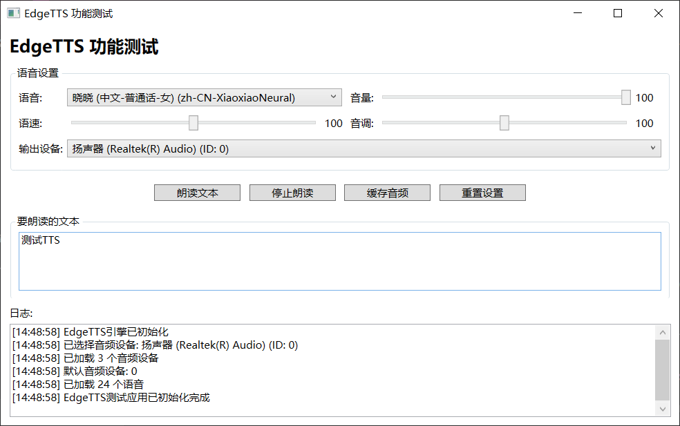

# EdgeTTS 测试工具

这是一个为EdgeTTS库提供的界面测试工具，用于直观地测试和验证EdgeTTS的各项功能。



## 工具介绍

本工具主要用于测试和演示EdgeTTS库的功能，通过图形界面让您可以方便地调用EdgeTTS的各种API，无需编写代码。

## EdgeTTS API 介绍

EdgeTTS库提供了以下主要API:

### 初始化

```csharp
// 创建EdgeTTS引擎实例，指定缓存文件夹和日志回调
_edgeTts = new EdgeTTSEngine(cacheFolder, LogCallback);
```

### 语音合成与播放

```csharp
// 获取所有可用语音
EdgeTTSEngine.Voices

// 异步朗读文本
await _edgeTts.SpeakAsync(text, settings);

// 停止当前朗读
_edgeTts.Stop();

// 获取音频文件(缓存)
string audioFile = await _edgeTts.GetAudioFileAsync(text, settings);
```

### 音频设备

```csharp
// 获取系统默认音频设备ID
int defaultDeviceId = EdgeTTSEngine.GetDefaultAudioDeviceId();

// 获取所有音频设备列表
List<AudioDevice> devices = EdgeTTSEngine.GetAudioDevices();
```

### 设置选项

```csharp
// 创建TTS设置
var settings = new EdgeTTSSettings
{
    Voice = "zh-CN-XiaoxiaoNeural",  // 语音
    Volume = 100,                    // 音量 (0-100)
    Speed = 100,                     // 语速 (0-200)
    Pitch = 100,                     // 音调 (0-200)
    AudioDeviceId = deviceId         // 音频输出设备ID
};
```

### 资源释放

```csharp
// 释放资源
_edgeTts.Dispose();
```

## 测试工具功能

- 语音选择与参数调整
- 音频设备选择
- 实时朗读文本
- 音频缓存到文件
- 详细日志记录

## 系统要求

- Windows 10/11
- .NET 8.0+
- 网络连接 